# Collekto AuthZ & Visibility — Understanding Document

**Source solution:** `Collekto-AuthZ-Visibility.pdf`  
**Audience:** Product / Engineering / stakeholder understanding  
**Context:** Godrej hierarchy — CRM Web + Manager app + Field Agent app (iOS & Android)  
**Companion:** `Collekto-AuthZ-Visibility-Client-Briefing.html`

---

## 0. Visual guide (start here)

This section is for **human understanding**. Skim the pictures and flow diagrams first; details follow below.

### 0.1 Three layers at a glance

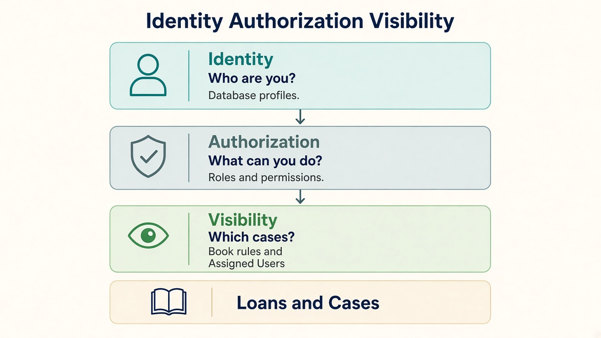

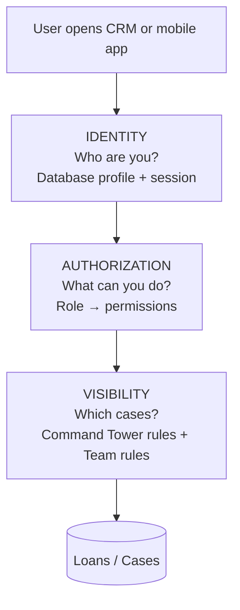

**One sentence:** Login proves identity; permissions decide allowed actions; visibility decides which loan rows appear.

---

### 0.2 Today vs target (Godrej hierarchy)

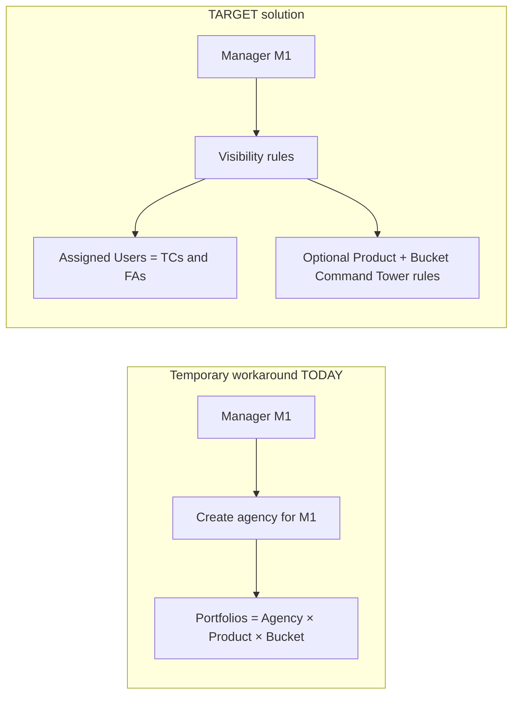

**Today:** separate agency per manager → portfolios multiply as managers × product/bucket.  
**Target:** configure who sees what with Visibility — no agency-per-manager for access.

---

### 0.3 Command Tower rules vs team rules

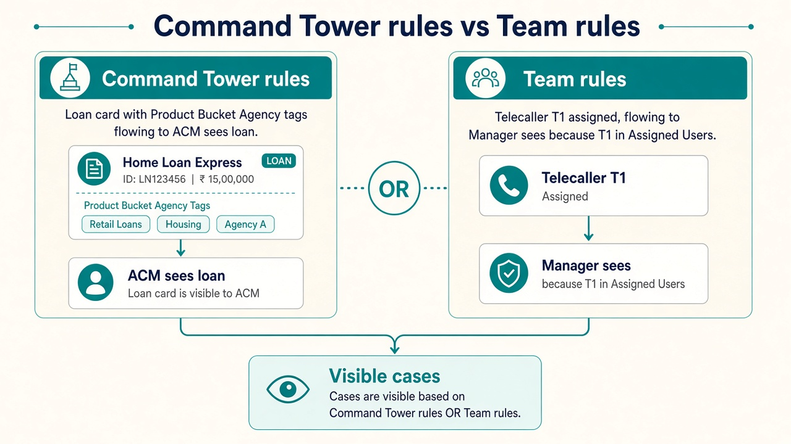

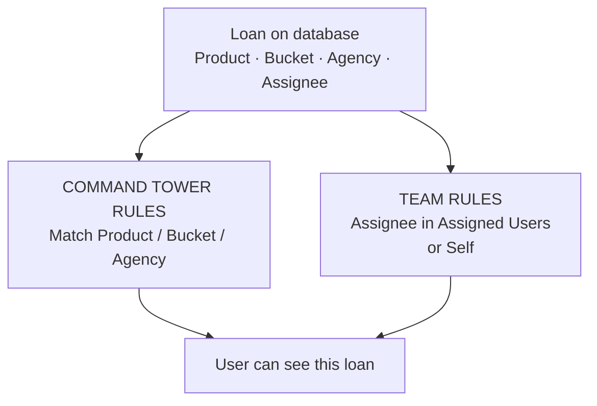

| Rule type | Looks at | Typical for | Example |
|-----------|----------|-------------|---------|
| **Command Tower rules** | Attributes on the **loan** | ACM / RCM / ZCM / NCM | Agency=Inhouse AND Product=PL AND Bucket=B1\|B2 |
| **Team rules** | **Who** is assigned | Manager; or ACM if TC/FA report directly | Assigned Users = T1\|F1 |
| **Self** | Assignee = me | Telecaller / Field Agent | Self Assigned = Y |
| **All Cases** | Whole tenant | Primary Tenant Admin | All Cases = Y |

Rows for the **same user** combine with **OR**. Columns in **one row** combine with **AND**.

---

### 0.4 How a loan becomes visible (end-to-end)

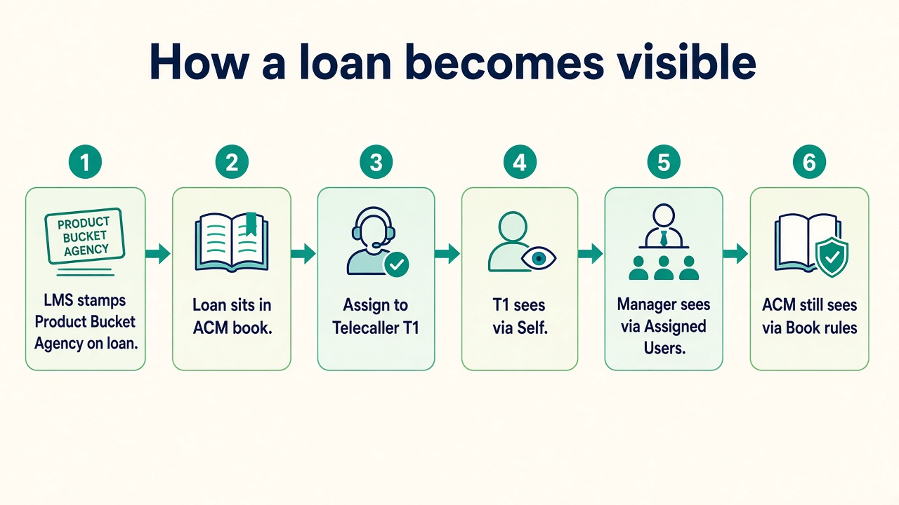

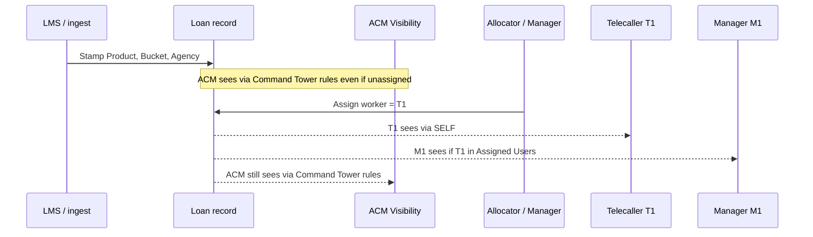

**Important:** the loan is assigned to the **telecaller/FA only**. Managers and ACMs **see** it through Visibility — they are not dual-assignees on the loan.

---

### 0.5 Who appears in dropdowns (people, not loans)

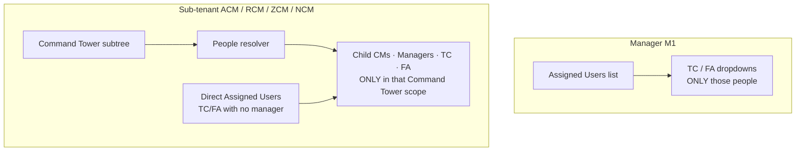

| Viewer | Dropdown content | Source |
|--------|------------------|--------|
| Manager | Only their TC/FA | Visibility **Assigned Users** |
| ACM / RCM / ZCM / NCM | People under their Command Tower scope + direct Assigned Users | **Command Tower** + people resolver + optional Assigned Users |
| Primary Tenant Admin | Wider / full as needed | Admin scope |

Dropdowns never grant loan access by themselves. Loan rows still need Visibility.

---

### 0.6 Runtime check (every list / detail / dashboard)

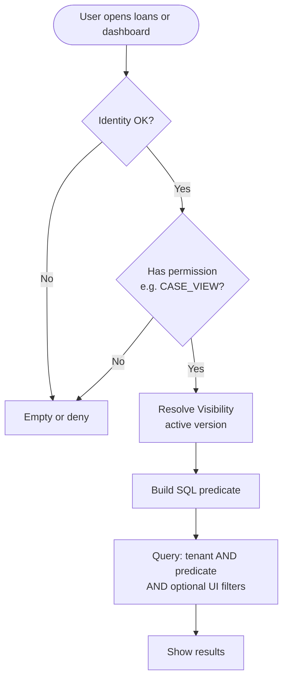

---

### 0.7 Publish visibility config

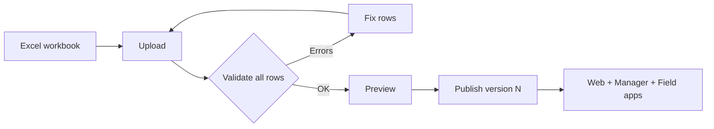

---

### 0.8 Direct report to ACM/RCM (no manager)

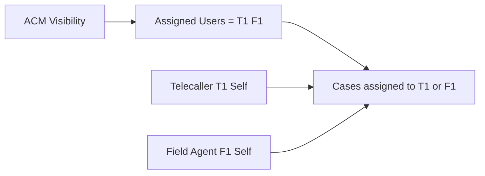

No dummy manager and no per-manager agency required.

---

## 1. Problem statement

### 1.1 Godrej hierarchy need

Godrej needs managers, telecallers, field agents, and sub-tenant roles (NCM/ZCM/RCM/ACM style) to see the right cases and the right people in dropdowns.

### 1.2 Temporary workaround today

A **separate agency is created for each manager**. Because:

```
Portfolio = Tenant + Agency + Product + Bucket
```

portfolios multiply as **managers × product/bucket**, which creates heavy maintenance.

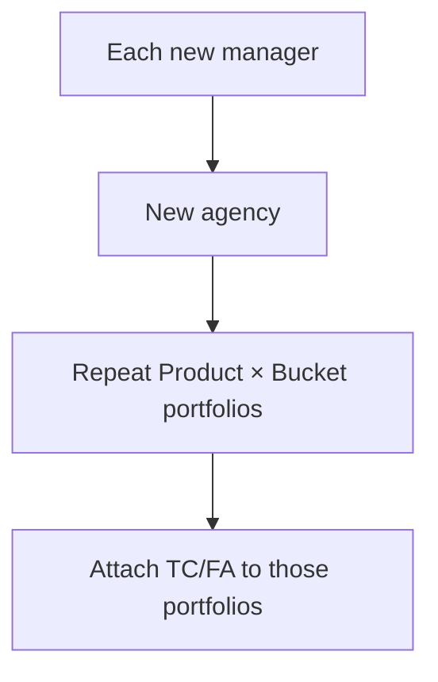

### 1.3 What must be answered consistently

| Capability | Question |
|------------|----------|
| **Identity** | Who is the user? *(database profiles)* |
| **Authorization** | What is the user allowed to do? |
| **Visibility** | Which cases/loans is the user allowed to access? |

---

## 2. Solution (what we are adopting)

Unified **Identity / Authorization / Visibility** (see pictures in §0).

### 2.1 Runtime rule

```
ACCESS = Authenticated Identity
       + Required Permission
       + Matching Visibility
```

### 2.2 Visibility dimensions (Godrej)

| Dimension | Godrej now | Notes |
|-----------|------------|-------|
| Assignee / Self / Assigned Users | Primary | Team + worker scope |
| Product, Bucket, Agency | Primary | **Command Tower rules** |
| Branch | Optional / blank | Future-ready, non-mandatory |
| All Cases | Primary Tenant Admin | Explicit only |

### 2.3 Command Tower vs Visibility

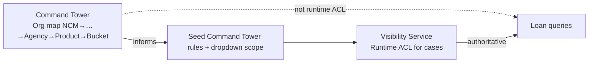

- **Command Tower:** org / reporting / seed / sub-tenant dropdown cascade  
- **Visibility:** which **loans** appear  

---

## 3. How it will be solved (end-to-end)

### 3.1 Visibility Service

- Versioned rules + conditions in the database  
- Resolve once → DB predicate (not per-case API)  
- Cache by tenant + user + version  
- Fail closed  

### 3.2 Allocation model

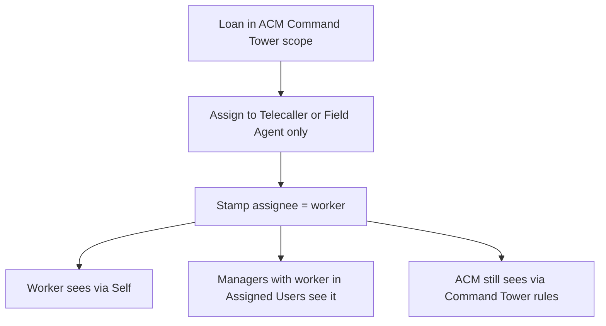

### 3.3 Profile cheat-sheet

| Profile | Typical Visibility |
|---------|-------------------|
| Primary Tenant Admin | All Cases |
| NCM/ZCM/RCM/ACM | Command Tower rules (± direct Assigned Users) |
| Manager | Assigned Users (± optional Command Tower rules) |
| Telecaller / Field Agent | Self |
| TC/FA reporting to ACM directly | ACM Assigned Users + their Self |

---

## 4. How data will be seeded

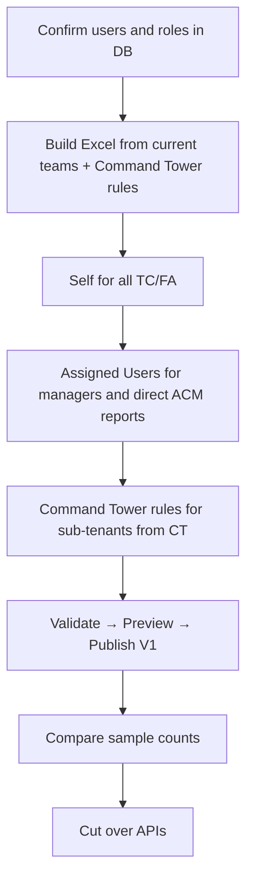

| Current signal | Seeded row |
|----------------|------------|
| Primary admin | All Cases = Y |
| TC / FA | Self = Y |
| Manager team | Assigned Users = team ids |
| Sub-tenant Command Tower scope | Product/Bucket/Agency rows |
| Direct ACM reports | Assigned Users on ACM |

---

## 5. How data will be maintained

| Change | Action |
|--------|--------|
| New TC/FA | Profile + Self; add to manager or ACM Assigned Users; publish |
| Move TC M1→M2 | Edit Assigned Users; publish |
| Expand ACM territory | Edit Command Tower rules; publish |
| CT org change | Update CT for dropdowns; refresh Command Tower rules seed if needed |

---

## 6. How screens will change

### CRM Web

| Screen | Change |
|--------|--------|
| Visibility Admin (new) | Upload / validate / preview / publish / versions |
| All Cases / search | Visibility predicate; multi-select filters only narrow |
| Dashboards / reports | Same scope |
| Manager team dropdowns | From Assigned Users |
| Sub-tenant filters | CT cascade + people resolver |
| Portfolio Control Panel | Shrink — not the ACL hub |

### Principle

> UX filters are convenience. Visibility is security.

---

## 7. Mobile apps (Manager + Field Agent, iOS & Android)

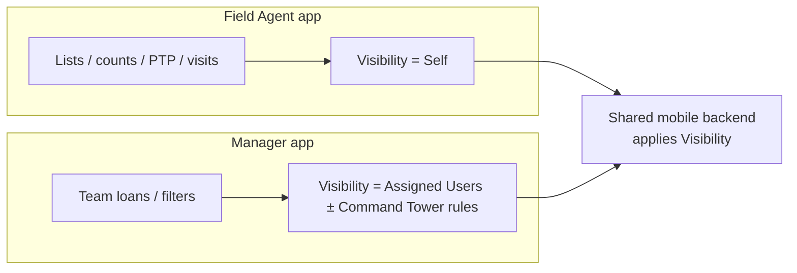

Portfolio picker is demoted or removed as a security boundary on both platforms.

---

## 8. Profile & feature impact (quick reference)

| Profile | Seed | Feel |
|---------|------|------|
| Tenant Admin | All Cases | Full tenant + Visibility Admin |
| Sub-tenant CM | Command Tower rules ± Assigned Users | Scoped dropdowns + Command Tower scope cases |
| Manager | Assigned Users | Only their TC/FA |
| TC / FA | Self | Own work only |

| Feature | Impact |
|---------|--------|
| Loan pages / dashboards / reports | Visibility scope |
| Assignment | Worker only; viewers via rules |
| Filters multi-select | ∩ Visibility |
| Settlement | Via visible loan + AuthZ |
| LMS ingest | Stamp attributes; no per-manager agency |
| SMS / Payment | Loan-id callbacks; not hierarchy ACL |

---

## 9. Phase-wise mental model

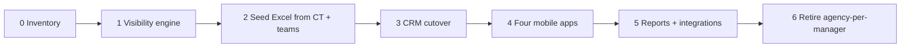

---

## 10. Validation notes

1. Solves temporary agency-per-manager hierarchy for access.  
2. Sub-tenants do **not** see all managers/agents — only their Command Tower scope.  
3. TC/FA can report directly to ACM/RCM via Assigned Users.  
4. Branch column exists but is non-mandatory for Godrej now.  
5. Fail closed: no Visibility config → no cases.

---

## 11. Document map

| Section | Content |
|---------|---------|
| **§0** | **Visual guide + flow diagrams + images** |
| §1 | Problem |
| §2 | Solution |
| §3 | How solved / allocation |
| §4–5 | Seed & maintain |
| §6–7 | Screens & mobile |
| §8–10 | Impact, phases, validation |

*Images live in `assets/`. Open the HTML briefing for an interactive sidebar version of the same story.*
